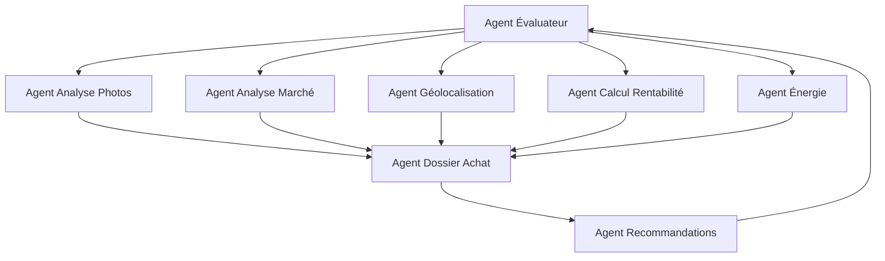

# 🤖 Spécifications Techniques des Agents Dust - Immobilier

## 🎯 Vue d'Ensemble

### 📋 **Architecture des 8 Agents Dust**
Chaque agent Dust aura des responsabilités spécifiques mais sera interconnecté pour créer un écosystème intelligent d'évaluation immobilière.

---

## 🏠 **1. AGENT ÉVALUATEUR IMMOBILIER** (Chef d'orchestre)

### 🎯 **Rôle Principal**
Coordonne l'ensemble du processus d'évaluation et synthétise les analyses de tous les autres agents.

### 📊 **Inputs**
```json
{
  "property_data": {
    "address": "123 Rue de la Paix, 75001 Paris",
    "photos": ["url1", "url2", "url3"],
    "basic_info": {
      "surface": 75.5,
      "rooms": 3,
      "property_type": "appartement"
    }
  },
  "buyer_profile": {
    "budget_max": 450000,
    "preferences": ["proche_metro", "bon_etat"]
  }
}
```

### 🔄 **Workflow Dust**
```yaml
name: "Agent Évaluateur Immobilier"
description: "Coordonne l'évaluation complète d'une propriété"

steps:
  1. trigger_photo_analysis:
      agent: "Agent Analyse Photos"
      input: "property_photos"
      
  2. trigger_market_analysis:
      agent: "Agent Analyse Marché"
      input: "property_address"
      
  3. trigger_location_analysis:
      agent: "Agent Géolocalisation"
      input: "property_coordinates"
      
  4. trigger_energy_analysis:
      agent: "Agent Énergie"
      input: "property_characteristics"
      
  5. trigger_rentability_analysis:
      agent: "Agent Calcul Rentabilité"
      input: "property_data + market_data"
      
  6. generate_dossier:
      agent: "Agent Dossier Achat"
      input: "all_analyses"
      
  7. generate_recommendations:
      agent: "Agent Recommandations"
      input: "complete_analysis + buyer_profile"
      
  8. synthesize_final_report:
      action: "create_comprehensive_report"
      output: "final_evaluation"
```

### 📤 **Outputs**
```json
{
  "final_score": 8.5,
  "confidence_level": 0.92,
  "price_estimate": 425000,
  "price_range": {
    "min": 395000,
    "max": 455000
  },
  "recommendations": {
    "action": "acheter_avec_negociation",
    "negotiation_advice": "Négocier 5-10% pour travaux énergétiques",
    "investment_potential": "bon"
  },
  "detailed_analysis": {
    "photo_analysis": {...},
    "market_analysis": {...},
    "location_analysis": {...},
    "energy_analysis": {...},
    "rentability_analysis": {...}
  }
}
```

### 🛠️ **Outils Dust**
- **SQL Query** : Accès aux bases de données
- **HTTP Request** : APIs externes (géolocalisation, météo)
- **Code** : Calculs de synthèse et scoring
- **Generate** : Génération de rapports

---

## 🤖 **2. AGENT ANALYSE PHOTOS**

### 🎯 **Rôle Principal**
Analyse automatique des photos de propriété pour détecter les défauts, évaluer l'état et identifier les éléments de valeur.

### 📊 **Inputs**
```json
{
  "photos": [
    {
      "url": "https://example.com/photo1.jpg",
      "room_type": "salon",
      "quality": "high"
    }
  ],
  "property_info": {
    "surface": 75.5,
    "rooms": 3,
    "age": 15
  }
}
```

### 🔄 **Workflow Dust**
```yaml
name: "Agent Analyse Photos"
description: "Analyse intelligente des photos de propriété"

steps:
  1. download_and_preprocess:
      action: "download_photos"
      tools: ["HTTP Request"]
      
  2. detect_defects:
      action: "ai_defect_detection"
      model: "custom_defect_detector"
      detect: ["fissures", "humidite", "usure", "electricite"]
      
  3. assess_condition:
      action: "ai_condition_assessment"
      model: "condition_classifier"
      classify: ["neuf", "excellent", "bon", "moyen", "à_renover"]
      
  4. identify_amenities:
      action: "ai_amenity_detection"
      model: "amenity_detector"
      detect: ["balcon", "parking", "ascenseur", "cave"]
      
  5. estimate_repair_costs:
      action: "calculate_repair_costs"
      tools: ["Code"]
      calculate: ["cost_per_defect", "total_repair_cost"]
      
  6. store_results:
      action: "store_analysis"
      tools: ["SQL Query"]
      store_in: "property_photos, property_defects"
```

### 📤 **Outputs**
```json
{
  "overall_condition": "bon",
  "condition_score": 7.2,
  "defects_detected": [
    {
      "type": "humidite",
      "severity": "modere",
      "location": "mur_cuisine",
      "estimated_cost": 2500,
      "confidence": 0.85
    }
  ],
  "amenities_identified": [
    {
      "type": "balcon",
      "confidence": 0.92,
      "size_estimate": 8.5
    }
  ],
  "total_repair_cost": 12500,
  "photo_quality_score": 8.8,
  "analysis_confidence": 0.88
}
```

### 🛠️ **Outils Dust**
- **HTTP Request** : Téléchargement des photos
- **Code** : Préprocessing et calculs
- **Custom Model** : Détection de défauts (Vision AI)
- **SQL Query** : Stockage des résultats

---

## 📊 **3. AGENT ANALYSE MARCHÉ**

### 🎯 **Rôle Principal**
Compare la propriété avec le marché local, analyse les tendances de prix et calcule la position concurrentielle.

### 📊 **Inputs**
```json
{
  "property": {
    "address": "123 Rue de la Paix, 75001 Paris",
    "surface": 75.5,
    "rooms": 3,
    "condition": "bon"
  },
  "analysis_date": "2024-01-15"
}
```

### 🔄 **Workflow Dust**
```yaml
name: "Agent Analyse Marché"
description: "Analyse comparative du marché immobilier local"

steps:
  1. fetch_local_market_data:
      action: "query_market_data"
      tools: ["SQL Query"]
      filters: ["city", "postal_code", "property_type", "date_range"]
      
  2. find_comparable_properties:
      action: "find_comparables"
      criteria: ["location", "size", "condition", "amenities"]
      max_distance: 500,
      max_age_difference: 2
      
  3. calculate_market_metrics:
      action: "calculate_metrics"
      metrics: ["avg_price_per_sqm", "median_price", "price_trend", "volume_trend"]
      
  4. analyze_market_position:
      action: "position_analysis"
      compare: ["price_vs_market", "time_to_sell", "demand_level"]
      
  5. predict_price_evolution:
      action: "price_forecast"
      model: "time_series_forecast"
      horizon: "6_months"
      
  6. store_analysis:
      action: "store_market_analysis"
      tables: ["market_comparison", "comparable_properties"]
```

### 📤 **Outputs**
```json
{
  "market_position": "marché",
  "price_percentile": 65,
  "market_metrics": {
    "avg_price_per_sqm": 5600,
    "median_price": 420000,
    "price_trend": "hausse",
    "price_evolution_6m": 3.2
  },
  "comparables": [
    {
      "property_id": "comp_001",
      "similarity_score": 0.87,
      "price": 435000,
      "price_per_sqm": 5780
    }
  ],
  "recommendations": {
    "market_timing": "bon",
    "price_strategy": "négociation_possible",
    "competition_level": "moyen"
  },
  "confidence_score": 0.91
}
```

### 🛠️ **Outils Dust**
- **SQL Query** : Accès aux données de marché
- **Code** : Calculs statistiques et comparaisons
- **Time Series Model** : Prédiction des prix
- **HTTP Request** : APIs de données immobilières

---

## 🗺️ **4. AGENT GÉOLOCALISATION**

### 🎯 **Rôle Principal**
Analyse l'environnement géographique, les services disponibles et l'accessibilité de la propriété.

### 📊 **Inputs**
```json
{
  "coordinates": {
    "latitude": 48.8566,
    "longitude": 2.3522
  },
  "address": "123 Rue de la Paix, 75001 Paris",
  "analysis_radius": 500
}
```

### 🔄 **Workflow Dust**
```yaml
name: "Agent Géolocalisation"
description: "Analyse géographique et services de proximité"

steps:
  1. geocode_address:
      action: "convert_address_to_coordinates"
      tools: ["HTTP Request"]
      api: "OpenStreetMap Geocoding"
      
  2. fetch_nearby_services:
      action: "query_nearby_services"
      radius: 500,
      services: ["metro", "bus", "shops", "schools", "hospitals", "parks"]
      
  3. calculate_accessibility_scores:
      action: "calculate_scores"
      metrics: ["walkability", "public_transport", "car_accessibility"]
      
  4. analyze_environment:
      action: "environmental_analysis"
      factors: ["pollution", "noise", "green_spaces", "safety"]
      
  5. calculate_travel_times:
      action: "calculate_travel_times"
      destinations: ["city_center", "airport", "main_station", "work_district"]
      
  6. store_location_data:
      action: "store_geolocation_data"
      tables: ["nearby_services", "transport_accessibility"]
```

### 📤 **Outputs**
```json
{
  "location_scores": {
    "walkability": 8.5,
    "public_transport": 9.2,
    "car_accessibility": 7.8,
    "overall_accessibility": 8.5
  },
  "nearby_services": {
    "metro_stations": [
      {
        "name": "Châtelet",
        "distance": 250,
        "line": "1, 4, 7, 11, 14",
        "walking_time": 3
      }
    ],
    "schools_count": 3,
    "hospitals_count": 2,
    "shops_count": 15
  },
  "travel_times": {
    "city_center": 8,
    "airport": 45,
    "main_station": 12
  },
  "environmental_factors": {
    "air_quality": "good",
    "noise_level": "moderate",
    "green_spaces": "excellent"
  },
  "safety_score": 8.7
}
```

### 🛠️ **Outils Dust**
- **HTTP Request** : APIs OpenStreetMap, Google Maps
- **Code** : Calculs de distances et scores
- **SQL Query** : Stockage des données géographiques

---

## 💰 **5. AGENT CALCUL RENTABILITÉ**

### 🎯 **Rôle Principal**
Calcule la rentabilité pour investissement locatif, optimise la fiscalité et simule différents scénarios financiers.

### 📊 **Inputs**
```json
{
  "property": {
    "price": 425000,
    "surface": 75.5,
    "rooms": 3,
    "location": "Paris 1er"
  },
  "investment_context": {
    "financing_rate": 3.5,
    "down_payment": 85000,
    "tax_regime": "lmnp"
  }
}
```

### 🔄 **Workflow Dust**
```yaml
name: "Agent Calcul Rentabilité"
description: "Analyse financière et rentabilité investissement"

steps:
  1. estimate_rental_income:
      action: "calculate_rental_income"
      tools: ["SQL Query", "Code"]
      factors: ["location", "size", "condition", "market_data"]
      
  2. calculate_expenses:
      action: "calculate_expenses"
      expenses: ["property_tax", "maintenance", "insurance", "management", "financing"]
      
  3. optimize_taxation:
      action: "tax_optimization"
      regimes: ["lmnp", "lmp", "deficit_foncier", "pinel"]
      
  4. simulate_scenarios:
      action: "financial_simulation"
      scenarios: ["optimistic", "realistic", "pessimistic"]
      horizon: "10_years"
      
  5. calculate_roi_metrics:
      action: "calculate_roi"
      metrics: ["gross_yield", "net_yield", "cash_flow", "irr", "payback_period"]
      
  6. store_financial_analysis:
      action: "store_analysis"
      table: "financial_analysis"
```

### 📤 **Outputs**
```json
{
  "rental_analysis": {
    "monthly_rent_estimate": 1850,
    "annual_rent_estimate": 22200,
    "rent_per_sqm": 24.5,
    "occupancy_rate": 0.95
  },
  "expenses": {
    "property_tax_annual": 3200,
    "maintenance_annual": 2200,
    "insurance_annual": 450,
    "management_fees_annual": 1110,
    "financing_cost_annual": 11900,
    "total_expenses_annual": 18860
  },
  "profitability": {
    "gross_yield": 5.22,
    "net_yield": 3.34,
    "cash_flow_annual": 3340,
    "irr_10_years": 4.8,
    "payback_period": 18.5
  },
  "tax_optimization": {
    "recommended_regime": "lmnp",
    "tax_savings_annual": 890,
    "after_tax_yield": 3.95
  },
  "scenarios": {
    "optimistic": {"yield": 4.2, "cash_flow": 4200},
    "realistic": {"yield": 3.3, "cash_flow": 3300},
    "pessimistic": {"yield": 2.1, "cash_flow": 2100}
  }
}
```

### 🛠️ **Outils Dust**
- **SQL Query** : Données de marché locatif
- **Code** : Calculs financiers complexes
- **HTTP Request** : APIs fiscales et bancaires
- **Generate** : Rapports financiers

---

## ⚡ **6. AGENT ÉNERGIE**

### 🎯 **Rôle Principal**
Analyse la consommation énergétique, identifie les améliorations possibles et calcule les économies potentielles.

### 📊 **Inputs**
```json
{
  "property": {
    "surface": 75.5,
    "construction_year": 1985,
    "energy_class": "D",
    "heating_type": "gaz_individuel",
    "insulation": "partielle"
  },
  "current_consumption": {
    "annual_consumption": 18000,
    "cost_per_kwh": 0.18
  }
}
```

### 🔄 **Workflow Dust**
```yaml
name: "Agent Énergie"
description: "Analyse énergétique et recommandations d'amélioration"

steps:
  1. analyze_current_consumption:
      action: "analyze_consumption"
      factors: ["size", "age", "heating_type", "insulation"]
      
  2. identify_improvements:
      action: "identify_improvements"
      categories: ["insulation", "heating", "windows", "ventilation"]
      
  3. calculate_improvement_costs:
      action: "calculate_costs"
      improvements: ["wall_insulation", "roof_insulation", "double_glazing", "heat_pump"]
      
  4. calculate_savings:
      action: "calculate_savings"
      period: "annual",
      factors: ["energy_savings", "cost_reduction", "aides_publiques"]
      
  5. optimize_investment:
      action: "optimize_investment"
      criteria: ["payback_period", "roi", "aides_disponibles"]
      
  6. store_energy_analysis:
      action: "store_analysis"
      table: "energy_analysis"
```

### 📤 **Outputs**
```json
{
  "current_analysis": {
    "annual_consumption": 18000,
    "annual_cost": 3240,
    "cost_per_sqm": 42.9,
    "energy_class": "D",
    "improvement_potential": 35
  },
  "recommended_improvements": [
    {
      "type": "wall_insulation",
      "investment": 8500,
      "annual_savings": 680,
      "payback_period": 12.5,
      "subsidies_available": 2550,
      "priority": "high"
    },
    {
      "type": "double_glazing",
      "investment": 3200,
      "annual_savings": 240,
      "payback_period": 13.3,
      "subsidies_available": 800,
      "priority": "medium"
    }
  ],
  "total_improvement": {
    "total_investment": 17200,
    "total_annual_savings": 1380,
    "net_investment_after_subsidies": 10300,
    "payback_period": 7.5,
    "roi_20_years": 168
  },
  "environmental_impact": {
    "co2_reduction_annual": 2.1,
    "energy_class_after": "B"
  }
}
```

### 🛠️ **Outils Dust**
- **Code** : Calculs énergétiques et thermiques
- **HTTP Request** : APIs ADEME, aides publiques
- **SQL Query** : Base de données énergétiques
- **Generate** : Certificats de performance

---

## 📋 **7. AGENT DOSSIER ACHAT**

### 🎯 **Rôle Principal**
Crée un dossier complet d'achat avec checklist, démarches administratives et planification des étapes.

### 📊 **Inputs**
```json
{
  "property": {
    "price": 425000,
    "address": "123 Rue de la Paix, 75001 Paris",
    "surface": 75.5,
    "rooms": 3
  },
  "buyer": {
    "budget": 450000,
    "financing_needed": true,
    "first_time_buyer": true
  }
}
```

### 🔄 **Workflow Dust**
```yaml
name: "Agent Dossier Achat"
description: "Création du dossier d'achat personnalisé"

steps:
  1. create_budget_breakdown:
      action: "calculate_total_costs"
      costs: ["property_price", "notary_fees", "guarantees", "taxes", "moving"]
      
  2. generate_checklist:
      action: "create_checklist"
      categories: ["financing", "legal", "technical", "administrative"]
      
  3. plan_administrative_steps:
      action: "plan_steps"
      timeline: "3_months",
      steps: ["loan_application", "insurance", "notary", "moving"]
      
  4. identify_required_documents:
      action: "identify_documents"
      context: ["first_time_buyer", "financing", "location"]
      
  5. estimate_timeline:
      action: "estimate_timeline"
      factors: ["financing_delay", "legal_procedures", "availability"]
      
  6. store_dossier:
      action: "store_dossier"
      table: "purchase_dossiers"
```

### 📤 **Outputs**
```json
{
  "budget_breakdown": {
    "property_price": 425000,
    "notary_fees": 29750,
    "guarantees": 8500,
    "taxes": 2100,
    "moving_costs": 1500,
    "total_budget": 466850,
    "financing_needed": 340000
  },
  "checklist": {
    "financing": [
      "Pré-approbation prêt",
      "Comparaison taux",
      "Assurance emprunteur",
      "Garantie prêt"
    ],
    "legal": [
      "Compromis de vente",
      "Diagnostics obligatoires",
      "Acte de vente",
      "Assurance habitation"
    ],
    "administrative": [
      "Changement adresse",
      "Abonnements",
      "Déménagement"
    ]
  },
  "timeline": {
    "total_duration": "3_months",
    "key_milestones": [
      {"step": "Pré-approbation", "duration": "2_weeks"},
      {"step": "Compromis", "duration": "1_week"},
      {"step": "Acte de vente", "duration": "2_months"}
    ]
  },
  "documents_required": [
    "Justificatifs revenus 3 ans",
    "Avis d'imposition",
    "Relevés bancaires",
    "Contrat de travail"
  ],
  "recommendations": [
    "Négocier les frais de notaire",
    "Comparer les assurances emprunteur",
    "Prévoir 10% de frais supplémentaires"
  ]
}
```

### 🛠️ **Outils Dust**
- **Code** : Calculs de coûts et planning
- **SQL Query** : Base de données procédures
- **HTTP Request** : APIs notaires, banques
- **Generate** : Documents et checklists

---

## 🎯 **8. AGENT RECOMMANDATIONS**

### 🎯 **Rôle Principal**
Analyse le profil de l'acheteur, match avec la propriété et génère des recommandations personnalisées.

### 📊 **Inputs**
```json
{
  "property_analysis": {
    "final_score": 8.5,
    "price_estimate": 425000,
    "condition": "bon",
    "location_score": 8.5
  },
  "buyer_profile": {
    "budget_max": 450000,
    "family_situation": "couple_enfants",
    "priorities": ["proche_metro", "bon_etat", "espace"],
    "timeline": "6_months"
  }
}
```

### 🔄 **Workflow Dust**
```yaml
name: "Agent Recommandations"
description: "Recommandations personnalisées pour l'acheteur"

steps:
  1. analyze_buyer_profile:
      action: "analyze_profile"
      factors: ["budget", "needs", "priorities", "constraints"]
      
  2. calculate_compatibility:
      action: "calculate_compatibility"
      criteria: ["price", "location", "size", "condition", "energy"]
      
  3. generate_recommendation:
      action: "generate_recommendation"
      decision: ["acheter", "négocier", "attendre", "éviter"]
      
  4. suggest_alternatives:
      action: "find_alternatives"
      criteria: "similar_properties",
      max_results: 5
      
  5. create_action_plan:
      action: "create_action_plan"
      steps: ["negotiation", "financing", "timeline"]
      
  6. store_recommendation:
      action: "store_recommendation"
      table: "property_recommendations"
```

### 📤 **Outputs**
```json
{
  "compatibility_analysis": {
    "overall_score": 8.7,
    "price_compatibility": 9.2,
    "location_compatibility": 8.5,
    "size_compatibility": 8.8,
    "condition_compatibility": 8.3,
    "energy_compatibility": 7.9
  },
  "recommendation": {
    "action": "acheter_avec_negociation",
    "confidence": 0.91,
    "reasoning": "Excellent rapport qualité-prix, emplacement idéal pour famille"
  },
  "negotiation_advice": {
    "recommended_price": 405000,
    "negotiation_margin": "5-10%",
    "arguments": [
      "Travaux énergétiques nécessaires",
      "Mise aux normes électriques",
      "Peinture à refaire"
    ],
    "max_acceptable_price": 430000
  },
  "action_plan": {
    "immediate_actions": [
      "Faire une offre sous conditions",
      "Lancer les diagnostics",
      "Déposer dossier prêt"
    ],
    "timeline": "3_weeks",
    "next_steps": [
      "Visite technique",
      "Négociation prix",
      "Signature compromis"
    ]
  },
  "alternatives": [
    {
      "property_id": "alt_001",
      "compatibility_score": 8.3,
      "advantages": ["Plus récent", "Meilleure isolation"],
      "disadvantages": ["Plus cher", "Moins bien situé"]
    }
  ],
  "risk_assessment": {
    "financial_risk": "low",
    "market_risk": "medium",
    "technical_risk": "low",
    "overall_risk": "low"
  }
}
```

### 🛠️ **Outils Dust**
- **Code** : Algorithmes de matching et scoring
- **SQL Query** : Recherche de propriétés similaires
- **Generate** : Rapports de recommandations
- **HTTP Request** : APIs de comparaison de prix

---

## 🔗 **INTERCONNEXION DES AGENTS**

### 📊 **Flux de Données**


### 🔄 **Synchronisation**
- **Temps réel** : Mise à jour des analyses en continu
- **Cache intelligent** : Éviter les recalculs inutiles
- **Fallback** : Gestion des pannes d'agents
- **Monitoring** : Surveillance des performances

---

## 🎯 **MÉTRIQUES DE PERFORMANCE**

### 📊 **KPIs par Agent**
- **Temps de réponse** : < 30 secondes par analyse
- **Précision** : > 90% sur les évaluations
- **Disponibilité** : 99.9% uptime
- **Coût par analyse** : < €0.50

### 🎯 **Objectifs Globaux**
- **Évaluation complète** : < 5 minutes
- **Précision prix** : ±5% vs prix de vente réel
- **Satisfaction utilisateur** : > 95%
- **ROI projet** : 300% en 12 mois

**Prêt à implémenter ces agents Dust ?** 🚀
